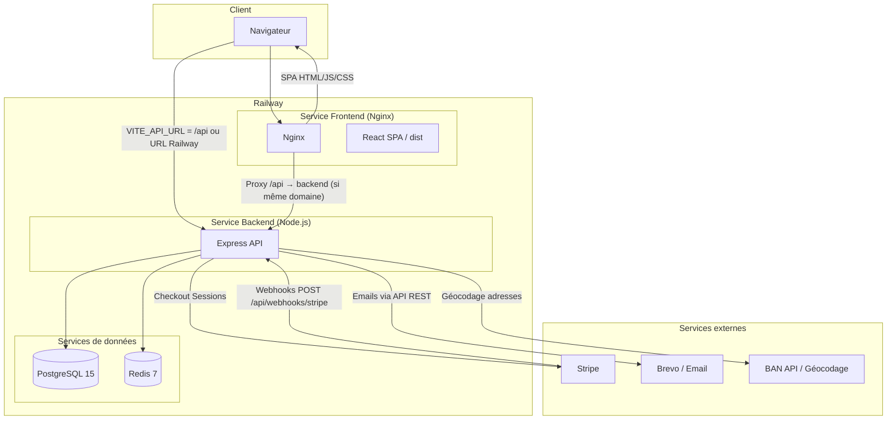
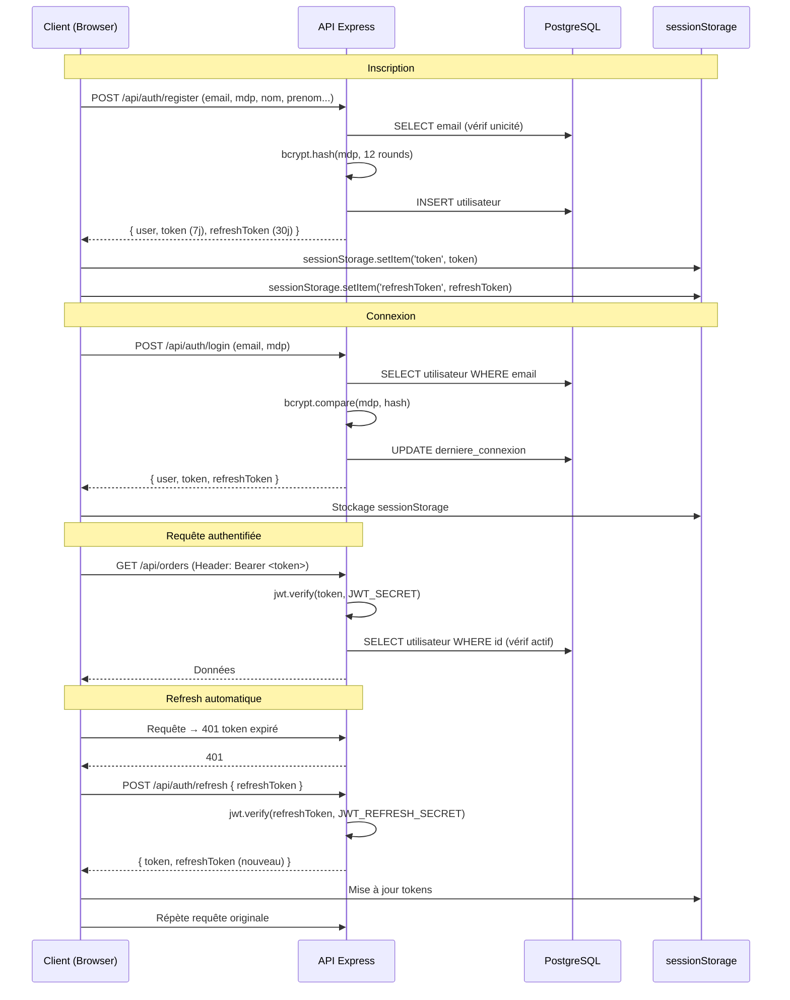
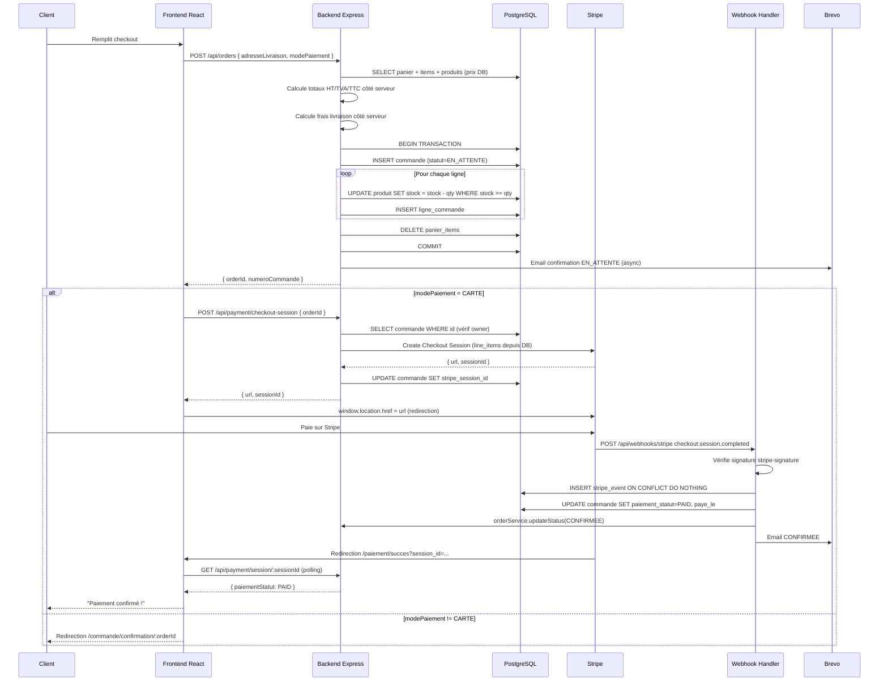
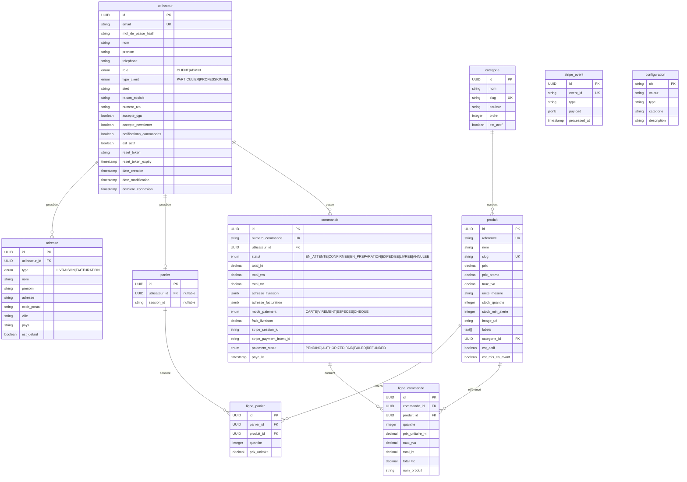

# 03 — Architecture Actuelle

> Confirmé = vérifié dans le code. Déduit = cohérent avec le code mais non testé en live. Supposé = non confirmé localement.

---

## Description générale

Jana Distribution est un **monorepo** composé de deux applications distinctes déployées séparément sur Railway :

- Un backend **Node.js / Express** exposant une API REST
- Un frontend **React / Vite** servi par **Nginx**

Les deux applications s'appuient sur une base de données **PostgreSQL** et un cache **Redis**. Le tout est dockerisé pour le développement local avec `docker-compose`.

---

## Diagramme d'architecture globale

**Confirmé** : Architecture générale, tous services, Docker Compose.

---

## Diagramme du flux d'authentification actuel

**Confirmé** : `auth.service.js`, `auth.middleware.js`, `api.js` (intercepteurs).

**Faiblesses** :
- Tokens stockés en `sessionStorage` (correct, migration depuis localStorage présente)
- Refresh token non stocké en DB → impossible à révoquer
- JWT access token 7 jours → longue durée sans révocation

---

## Diagramme du flux de commande actuel

**Confirmé** : Intégralité des fichiers source analysés.

---

## Diagramme du modèle de données principal

**Confirmé** : `backend/scripts/init.sql` intégralement lu.

---

## Zones inconnues et supposées

| Zone | Type | Note |
|---|---|---|
| Données réelles en production Railway | Supposé | Accès Railway non disponible lors de l'audit |
| Variables d'environnement Railway | Supposé | Non vérifiées localement |
| Stripe configuré en mode test ou live | Supposé | Dépend de la valeur de `STRIPE_SECRET_KEY` |
| Brevo configuré et opérationnel | Supposé | Dépend de `BREVO_API_KEY` |
| Nginx proxy /api en production | Déduit | `vite.config.js` et config Nginx non encore lue intégralement |

---

## Faiblesses architecturales identifiées

1. **Stockage des uploads sur disque local** — Les images sont stockées dans `backend/uploads/products/`. Railway utilise un système de fichiers éphémère, donc les images disparaissent à chaque redéploiement.

2. **Pas de système de migrations versionné** — Les modifications de schéma s'appliquent via `init.sql` qui supprime et recrée toutes les tables (`DROP TABLE IF EXISTS`), donc destructif en production.

3. **Deux packages Redis** — `ioredis` et `redis` sont tous deux installés. Seul `ioredis` est réellement utilisé dans `redis.js`.

4. **Pas de table de factures** — Absente du schéma initial.

5. **Pas d'historique des statuts de commande** — Seul le statut courant est stocké, pas les transitions.

6. **Tokens JWT non révocables** — Aucune blacklist, aucun stockage du refresh token.

7. **Encodage corrompu** — Plusieurs fichiers contiennent des séquences UTF-8 mal encodées (`é`, `€`). Cela suggère une manipulation des fichiers avec un éditeur ou un environnement de mauvaise configuration d'encodage.
