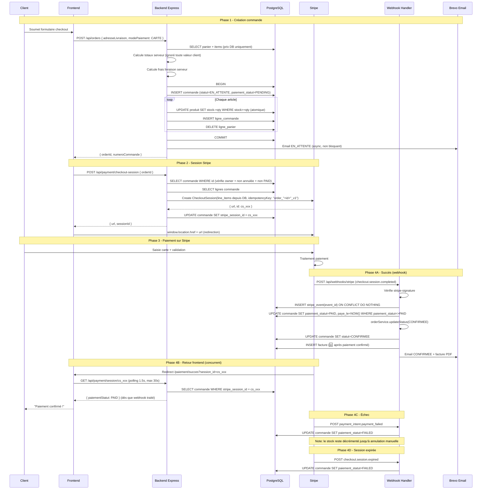

# 08 — Stripe et Paiements

---

## Analyse de l'existant

### Ce qui est implémenté

| Composant | État | Fichier |
|---|---|---|
| Stripe Checkout Session côté serveur | ✅ | `payment.service.js` |
| Montants reconstruits depuis DB (pas du client) | ✅ | `payment.service.js:55` |
| Idempotency-key sur création session | ✅ | `payment.service.js:81` |
| Webhook route avec body brut | ✅ | `webhook.routes.js`, `index.js:94` |
| Vérification signature webhook | ✅ | `paymentService.verifyWebhookSignature` |
| Idempotency webhook (`stripe_event`) | ✅ | `payment.service.js:145` |
| `checkout.session.completed` → PAID | ✅ | `payment.service.js:186` |
| `checkout.session.expired` → FAILED | ✅ | `payment.service.js:224` |
| `payment_intent.payment_failed` → FAILED | ✅ | `payment.service.js:233` |
| `charge.refunded` → REFUNDED | ⚠️ | `payment.service.js:244` |
| Protection double PAID (idempotent) | ✅ | `order.repository.js:497` |
| Auto-transition EN_ATTENTE → CONFIRMEE | ✅ | `payment.service.js:210` |
| Page succès avec polling serveur | ✅ | `PaymentSuccessPage.jsx` |
| Page annulation | ✅ | `PaymentCancelPage.jsx` |
| Ownership commande vérifiée | ✅ | `payment.service.js:33` |
| Email notification CONFIRMEE | ✅ | Via `orderService.updateStatus` |
| Modes non-CARTE (virement, chèque, espèces) | ✅ | Flux alternatif checkout |
| Validation manuelle paiement CARTE bloquée | ✅ | `payment.controller.js:82` |

### Ce qui manque ou est problématique

| Problème | Priorité | Description |
|---|---|---|
| `charge.refunded` au lieu de `refund.created` | P1 | Événement moins précis, remboursement partiel non géré |
| Pas de bouton "rembourser" admin | P1 | L'admin ne peut pas initier un remboursement depuis l'interface |
| `stripe_event.payload` complet stocké | P1 | Données potentiellement sensibles en clair |
| Pas d'environnement séparé staging/prod | P1 | Clés test/live non séparées par environnement |
| Metadata Stripe limitées | P2 | Ajouter `email_client`, `type_client` pour faciliter reconciliation |

---

## Option Stripe recommandée

L'implémentation actuelle utilise **Stripe Checkout** (redirection vers une page hébergée par Stripe). C'est **le bon choix** pour ce projet.

### Comparatif des options

| Option | Sécurité | Complexité | UX | Maintenance | Recommandation |
|---|---|---|---|---|---|
| **Stripe Checkout** (actuel) | ✅ Maximale | ✅ Faible | ⚠️ Redirection | ✅ Minimale | **Garder** |
| Payment Intents + Elements | ✅ Bonne | ❌ Élevée | ✅ Intégré | ❌ Élevée | Non recommandé |
| Elements uniquement | ✅ Bonne | ❌ Élevée | ✅ Intégré | ❌ Élevée | Non recommandé |

Stripe Checkout gère automatiquement :
- PCI-DSS compliance complète
- 3DS2 (authentification forte)
- Apple Pay / Google Pay
- Interface localisée en français
- Retries sur échec réseau

---

## Flux de paiement complet recommandé (avec corrections)



---

## Variables d'environnement nécessaires

| Variable | Environnement | Description |
|---|---|---|
| `STRIPE_SECRET_KEY` | Backend | `sk_test_...` en test, `sk_live_...` en prod |
| `STRIPE_WEBHOOK_SECRET` | Backend | `whsec_...` depuis Stripe Dashboard ou CLI |
| `STRIPE_PUBLISHABLE_KEY` | Frontend | `pk_test_...` ou `pk_live_...` (pour @stripe/stripe-js si besoin futur) |
| `FRONTEND_URL` | Backend | URL du frontend pour construire `success_url` et `cancel_url` |

**Important** : Avoir deux ensembles de clés Stripe séparés pour staging et production.

---

## Webhook Stripe — Événements à gérer

| Événement | Statut actuel | Action recommandée |
|---|---|---|
| `checkout.session.completed` | ✅ Traité | Conserver + ajouter génération facture |
| `checkout.session.expired` | ✅ Traité | Conserver |
| `payment_intent.payment_failed` | ✅ Traité | Conserver |
| `charge.refunded` | ⚠️ Traité partiellement | Remplacer par `refund.created` |
| `refund.created` | 🚫 Absent | **Ajouter** — plus précis, gère les remboursements partiels |
| `payment_intent.succeeded` | 🚫 Absent | Optionnel — redondant avec session.completed |

---

## Correction recommandée pour les remboursements

### Problème actuel

`charge.refunded` est déclenché à chaque remboursement (partiel ou total). L'implémentation actuelle marque toute la commande `REFUNDED` même pour un remboursement partiel.

### Solution recommandée

```javascript
// payment.service.js — remplacer _onChargeRefunded par :
async _onRefundCreated(refund) {
  const paymentIntentId = refund.payment_intent;
  if (!paymentIntentId) return;

  const row = await query(
    `SELECT id, total_ttc FROM commande WHERE stripe_payment_intent_id = $1`,
    [paymentIntentId]
  );
  if (!row.rows.length) return;

  const commande = row.rows[0];
  const montantRembourse = refund.amount / 100; // Stripe en centimes
  const montantTotal = parseFloat(commande.total_ttc);

  // Remboursement total = toute la commande, partiel = note seulement
  if (Math.abs(montantRembourse - montantTotal) < 0.01) {
    await orderRepository.updatePaymentStatus(commande.id, 'REFUNDED');
    // Générer avoir
  } else {
    // Remboursement partiel : logguer, ne pas changer statut global
    logger.info('Remboursement partiel Stripe', {
      orderId: commande.id,
      montantRembourse,
      stripeRefundId: refund.id
    });
  }
}
```

---

## Modèle de données Stripe (existant + recommandé)

```sql
-- Existant (dans table commande) :
stripe_session_id VARCHAR(255)
stripe_payment_intent_id VARCHAR(255)
paiement_statut statut_paiement

-- À ajouter :
stripe_refund_id VARCHAR(255)           -- ID du remboursement Stripe

-- Table stripe_event (existante) — à simplifier :
-- Ne stocker que : event_id, type, processed_at
-- Retirer : payload JSONB (données sensibles)
```

---

## Critères d'acceptation Stripe

- [ ] Session Stripe créée uniquement côté serveur
- [ ] Montant Stripe reconstruit depuis lignes DB, jamais depuis le client
- [ ] Webhook vérifié par signature avant tout traitement
- [ ] Double webhook ignoré sans erreur (idempotent)
- [ ] Commande confirmée uniquement via webhook, jamais via URL retour
- [ ] Paiement FAILED correctement loggué et statut mis à jour
- [ ] Session expirée correctement gérée
- [ ] Remboursement total correctement traité (avoir généré)
- [ ] Remboursement partiel loggué mais ne corrompt pas le statut
- [ ] Clés test et prod distinctes par environnement
- [ ] `STRIPE_WEBHOOK_SECRET` requis et lève erreur si absent
- [ ] Aucune donnée bancaire stockée dans l'application
